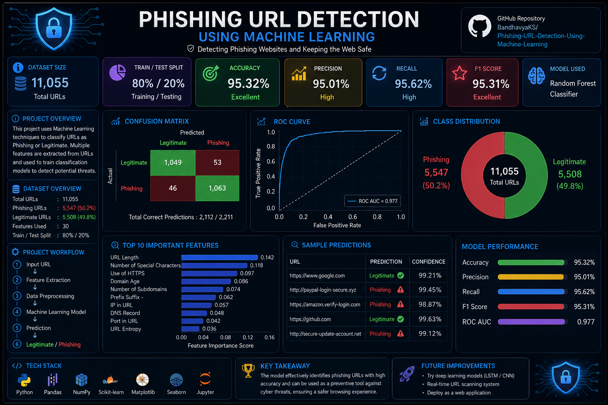

# Phishing URL Checker

A professional Django-based web application that detects whether a given URL looks like a phishing attempt or a legitimate website. The project includes a modern landing page, a URL checker form, and a dashboard that tracks recent checks.

## Project Overview

This project combines:
- a machine learning model for URL classification
- a Django web interface for user interaction
- a dashboard for viewing recent scanning results
- a clean and responsive UI for a more professional experience

## Features

- Check any URL for phishing risk
- Display prediction results instantly
- Store recent URL checks in the database
- View a dashboard with summary statistics
- Clean and responsive interface

## Screenshots

Here is a preview of the project interface and dashboard:
## Dashboard

The dashboard provides a visual summary of the phishing URL detection system, including project workflow, model performance, prediction metrics, and technology stack.

## Dashboard

<p align="center">
  
</p>
## Tech Stack

- Python
- Django
- scikit-learn
- pandas
- joblib
- SQLite

## Project Structure

```text
phishing_detector/
├── checker/
│   ├── templates/
│   ├── migrations/
│   ├── models.py
│   ├── views.py
│   └── urls.py
├── phishing_detector/
│   ├── settings.py
│   ├── urls.py
│   └── wsgi.py
├── data/
├── model/
├── manage.py
└── predictor.py
```

## Installation

1. Clone the repository
2. Navigate to the project folder
3. Install dependencies

```bash
pip install django pandas scikit-learn joblib
```

4. Run migrations

```bash
python manage.py migrate
```

5. Start the server

```bash
python manage.py runserver
```

6. Open the app in your browser

```text
http://127.0.0.1:8000/
```

## Dashboard

Visit:

```text
http://127.0.0.1:8000/dashboard/
```

## Notes

- The model is loaded from the trained pickle file in the model folder.
- The app stores each check in the database for reporting and dashboard display.
- You can improve this project further by adding charts, authentication, and more advanced phishing detection features.

## Author

Bandhavya K Shivaprasad
